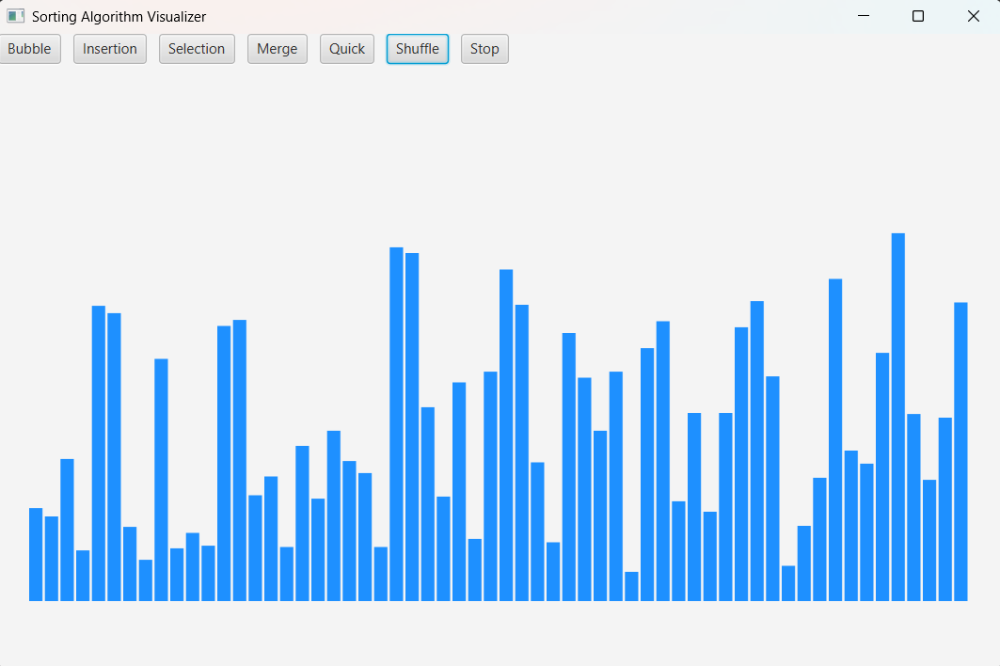
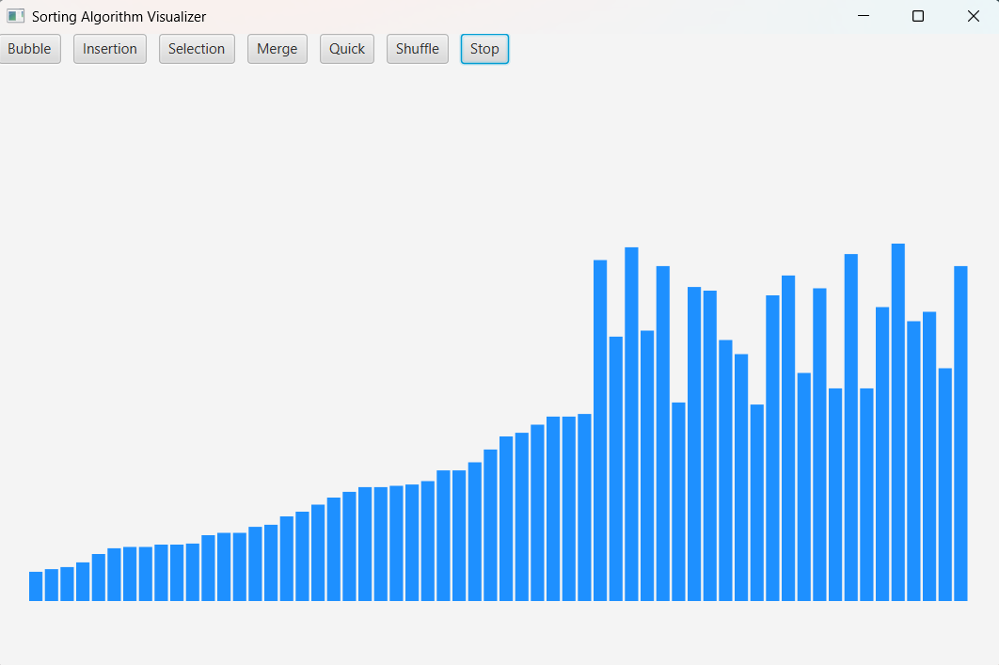
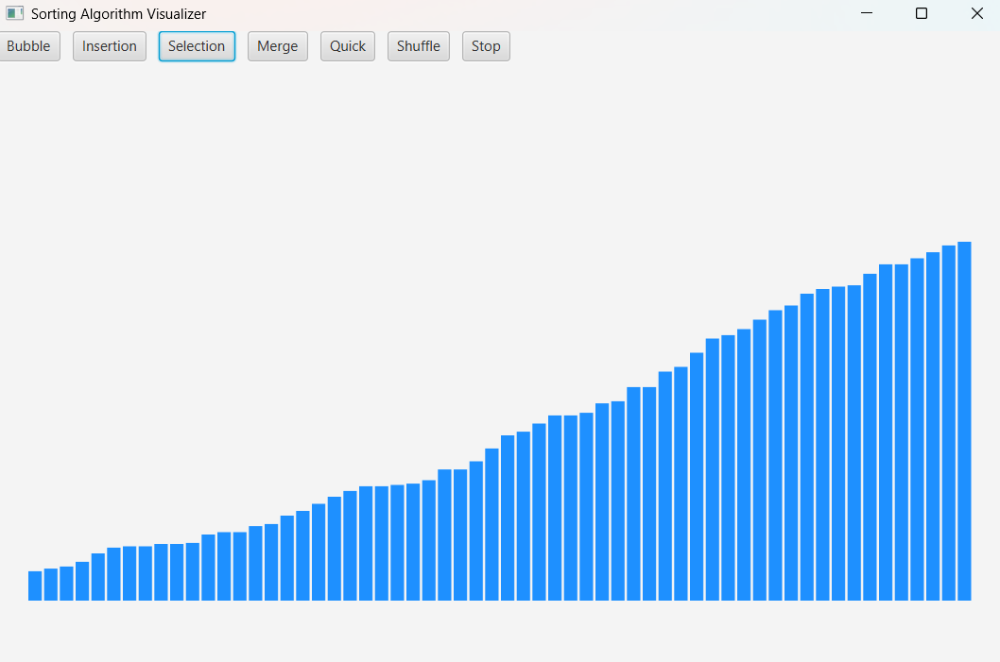

# Sorting Algorithm Visualizer (JavaFX)

A JavaFX-based desktop application that visually demonstrates how classic sorting algorithms work step by step using animated bars.

This project focuses on algorithm visualization, multithreading, and UI responsiveness, not just producing sorted output.

## Screenshots

### Before Sorting


### During Sorting


### After Sorting



## Features
- Visualizes sorting algorithms using animated bars
- Implemented sorting algorithms:
  - Bubble Sort
  - Insertion Sort
  - Selection Sort
  - Merge Sort
  - Quick Sort
- Runs sorting logic on a background thread to keep the UI responsive
- Safe UI updates using JavaFX Application Thread
- Stop and Shuffle controls to interrupt sorting gracefully

---

## Technologies Used
- Java
- JavaFX
- Multithreading
- Sorting Algorithms
- Object-Oriented Programming

---

## Project Structure
src/
├── SortVisualizerFX.java
├── SortAlgorithm.java
├── StopFlag.java
├── BubbleSort.java
├── InsertionSort.java
├── SelectionSort.java
├── MergeSort.java
└── QuickSort.java


---

## How It Works
- Array elements are represented as vertical bars
- Bar height corresponds to the value of the element
- Sorting algorithms perform comparisons and swaps
- After each significant operation, the UI is updated to visualize changes
- A shared volatile stop flag is used to safely stop sorting when requested

---

## How to Run
1. Install **JDK 17+**
2. Download **JavaFX SDK**
3. Compile and run:

```bash
javac --module-path /path/to/javafx/lib --add-modules javafx.controls -d out src/*.java
java --module-path /path/to/javafx/lib --add-modules javafx.controls -cp out SortVisualizerFX


Author
Harshit Garg
